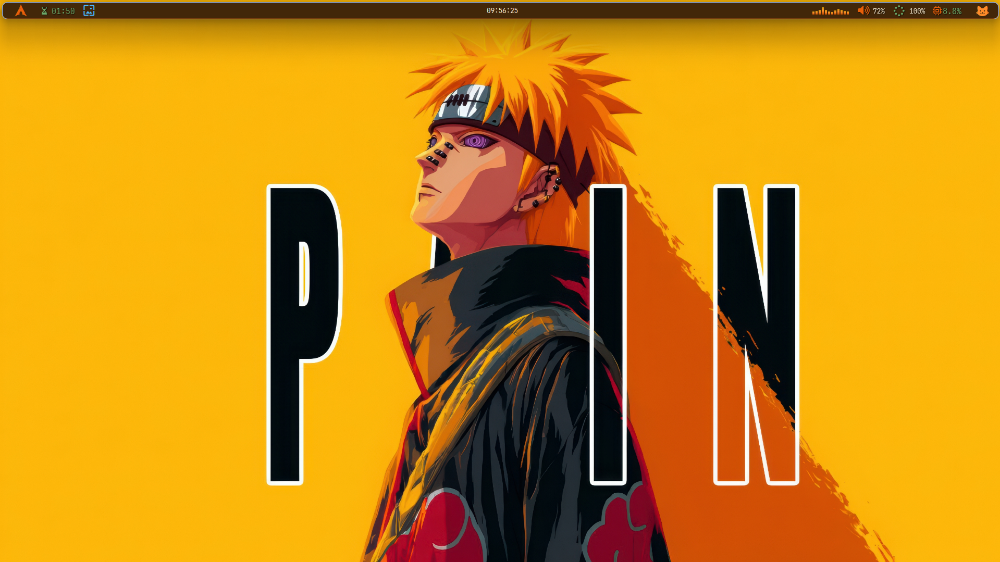
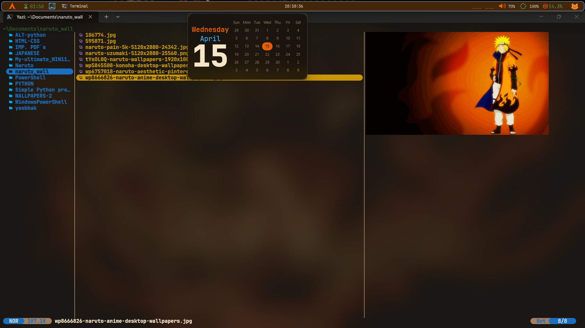
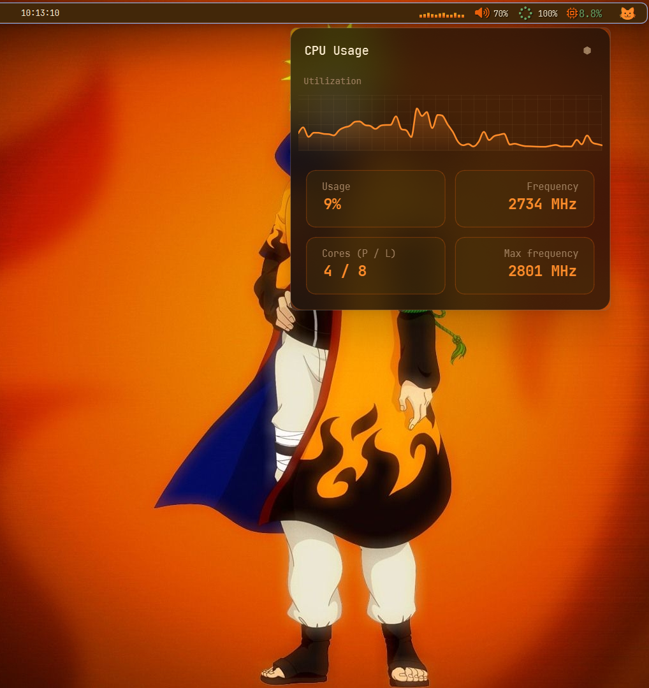
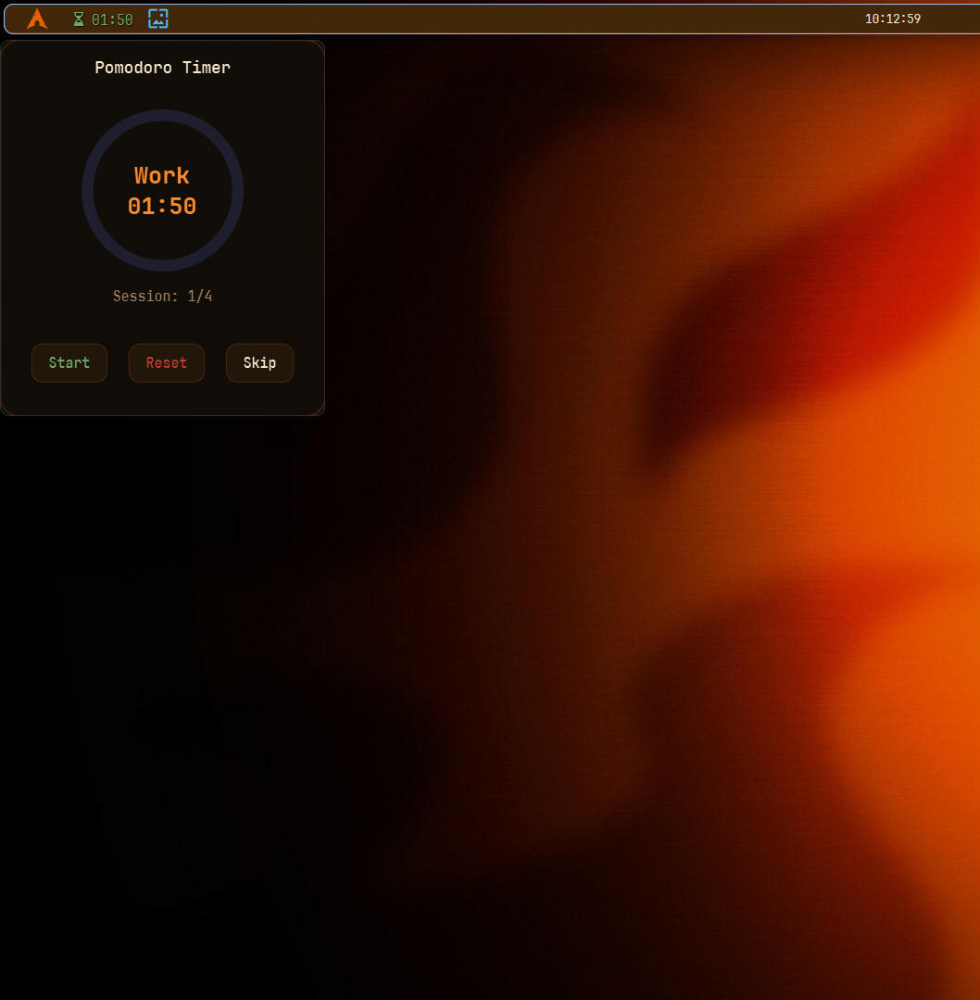
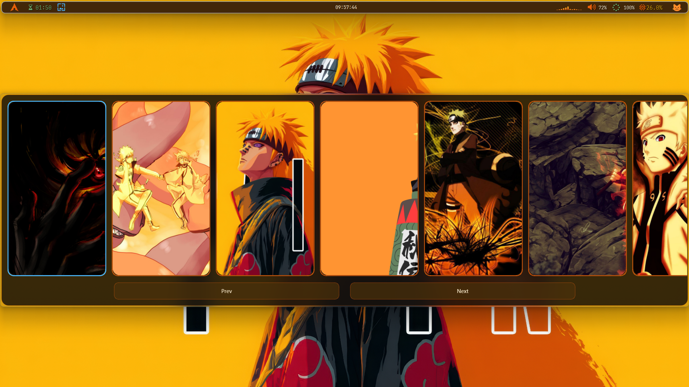
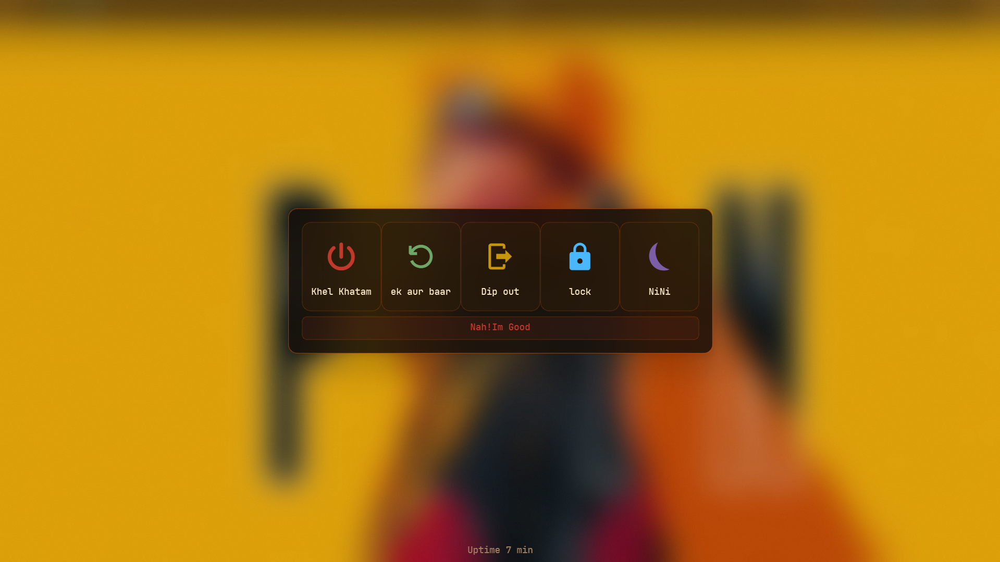
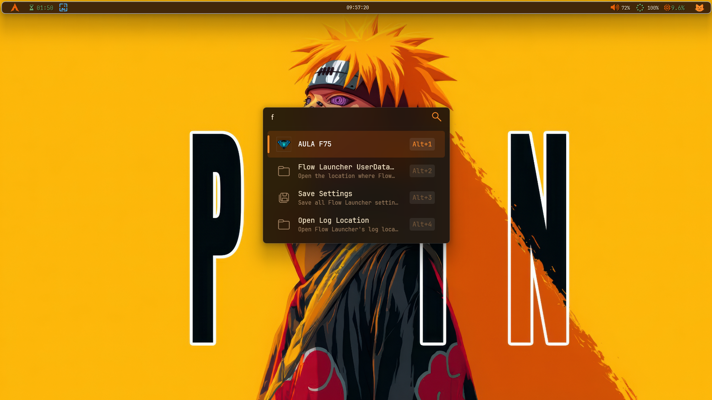
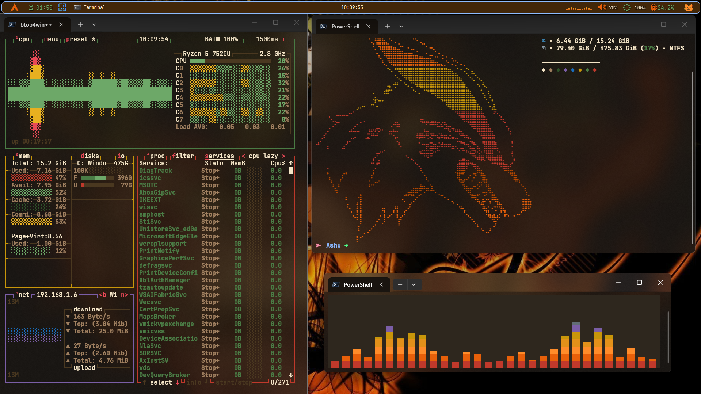
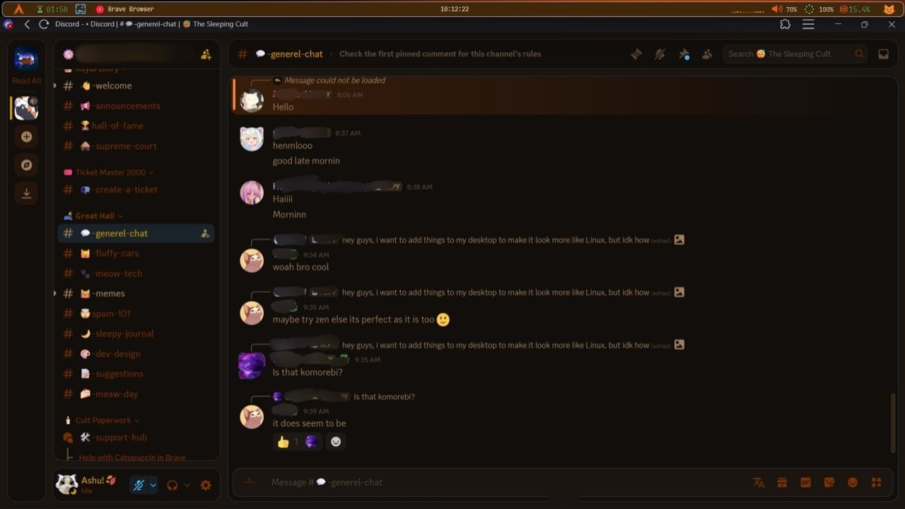

# __✨ NARUTO (orange) Themed ✨__

- A collection of Windows 11 customizations — focused on a clean, aesthetic, and productive workflow.

## __🍜*The Theme is Based on NARUTO🦊*__

### *🖼️ Preview*
---

- __YASB__

    

    
    

    

    
    

    

    
    

    

    
    

    

    
    

    

    
    

---

- __Flow Launcher__
    

    
    

- __cava & Terminal__
    

    
    

- __Discord__
    

    
    

---
## ⚙️ Setup Guide

 > Follow this Repo to set everything up , This is my personal setup . I always keep updating there:) [HERE](https://github.com/Ashutosh03x/My-ultimate_WIN11_setup)
---

#### 🚧 Status

This project is still in progress. I will keep improving and adding more configs over time.
